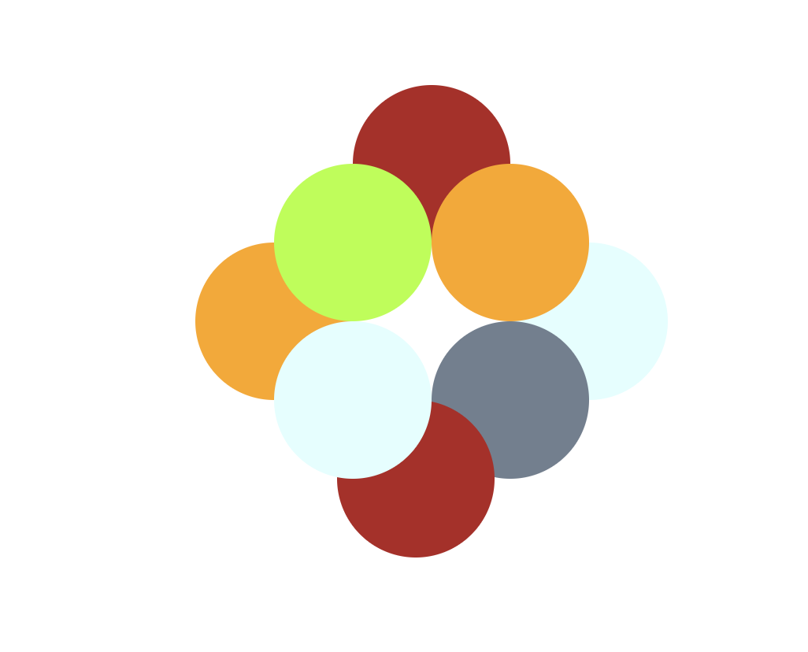

# Shapes

For this project, we used the CSS z-index property to recreate an image of circles of varying colors stacked on top of one another at various locations and in four different layers. This is a HTML file with embedded CSS. 

## Installation

This file can be viewed locally as a .html file. 

## Please see below for a screenshot of this project:

